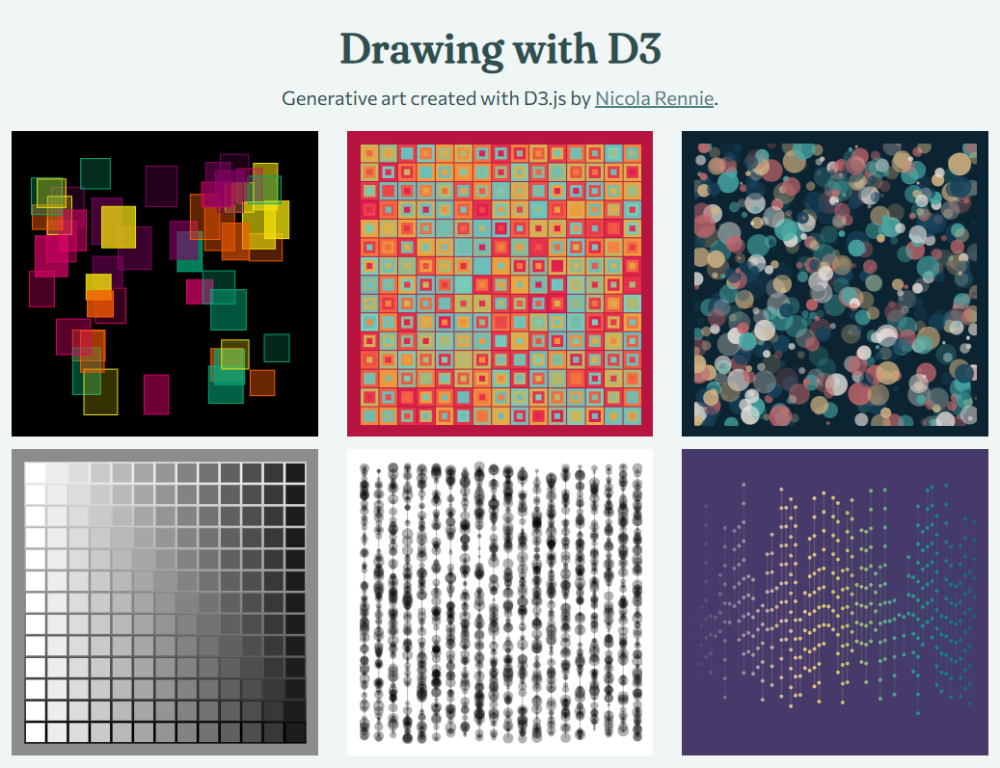

# Drawing with D3

**Drawing with D3** is a project to make generative art using [D3.js](https://d3js.org/). View examples on the website at [nrennie.rbind.io/drawing-with-d3](https://nrennie.rbind.io/drawing-with-d3/).

  

To see examples of generative art made using R or Python, go to [nrennie.rbind.io/art-gallery](https://nrennie.rbind.io/art-gallery/).
